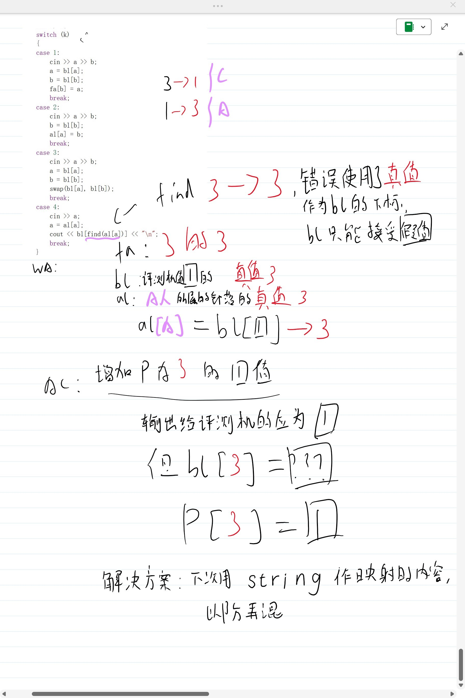

# 给自己看的题解，记录一下做题解法和思路等

## [选择配送](./hdu25春/1010%20选择配送.html)

计算曼哈顿距离最大值的最小值，转化成切比雪夫距离，切比雪夫距离定义如下：

设 $A(x_1,y_1),B(x_2,y_2)$

$d(A,B)=\max\{|x_1-x_2|,|y_1-y_2|\}$

曼哈顿距离与切比雪夫距离可以相互转化：

$\begin{aligned}D_{man}(A,B)&=|x_1-x_2|+|y_1-y_2|\\&=\max\{x_1-x_2+y_1-y_2,x_1-x_2+y_2-y_1,x_2-x_1+y_1-y_2,x_2-x_1+y_2-y_1\}\\&=\max\{|(x_1+y_1)-(x_2+y_2)|,|(x_1-y_1)-(x_2-y_2)|\}\\&=d((x_1+y_1,x_1-y_1),(x_2+y_2,x_2-y_2))\end{aligned}$

几何表示为将 $x+y$ 和 $x-y$ 作为新的坐标系，把曼哈顿距离转化为直线距离。


思路：
计算出所有客户哈密顿坐标，求最大/小的切比雪夫 $x,y$ 值。

读入快递站的坐标，转化成切比雪夫，与前面算好的 4 个值求最小 dist  

```cpp
#include <bits/stdc++.h>
using namespace std;
const int N = 100000 + 10;
const int INF = 2147483647;
typedef long long ll;
const ll inf = 1e18;
int main()
{
    ios::sync_with_stdio(0), cin.tie(0);
    int t;
    cin >> t;

    while (t--)
    {
        ll maxS = -inf, minS = inf;
        ll maxD = -inf, minD = inf;
        ll n, m;
        cin >> n >> m;
        for (int i = 1; i <= n; i++)
        {
            int x, y;
            cin >> x >> y;
            ll s = x + y;
            ll d = x - y;
            maxS = max(maxS, s);
            minS = min(minS, s);
            maxD = max(maxD, d);
            minD = min(minD, d); 
        }
        ll ans = inf;
        for (int j = 1; j <= m; j++)
        {
            ll a, b;
            cin >> a >> b;
            ll s = a + b, d = a - b;
            ll dist = max({abs(maxS - s), abs(s - minS), abs(maxD - d), abs(d - minD)});
            ans = min(ans, dist);
        }
        cout << ans << "\n";
    }
}
```

> 自己写的时候把maxmin的初始化写到while外面去了。。。。调了一晚上，下次改成while(t--) solve();的形式避免这个问题

## 修复公路

题意是个求**连通块总数量-1**的题目。每次连通块=n，每次merge就-1，最后答案-1。

```cpp
#include <bits/stdc++.h>
using namespace std;
const int N = 300000 + 10;
int num[N];
int pre[N];
int rnk[N];
int find(int x)
{
    if (pre[x] == x)
        return x;
    return pre[x] = find(pre[x]);
}
void merge(int x, int y, int &components)
{
    x = find(x);
    y = find(y);
    if (x == y)
        return;
    if (rnk[x] < rnk[y])
    {
        swap(x, y);
    }
    pre[y] = x;
    if (rnk[x] == rnk[y])
        rnk[x]++;
    components--;
}
int main()
{
    ios::sync_with_stdio(false);
    cin.tie(0);
    int t;
    cin >> t;
    while (t--)
    {
        int n;
        cin >> n;
        for (int i = 1; i <= n; i++)
        {
            cin >> num[i];
        }
        for (int i = 1; i <= n; i++)
        {
            pre[i] = i;
            rnk[i] = 0;
        }
        int components = n;
        for (int i = 1; i <= n; i++)
        {
            if (i + num[i] <= n)
                merge(i, i + num[i], components);
            if (i - num[i] >= 1)
                merge(i, i - num[i], components);
        }
        cout << components - 1 << "\n";
    }
}
```

## [部落冲突](./hdu25春/1011%20部落冲突.html)

去掉3操作，就是一个可以用并查集解决的问题，al[i] 表示第 i 个人的部落，查询直接 find(al[a]) 即可。

加上3操作就维护一个评测机的值（成为评测值），和本地电脑的真实值的映射关系，每次 3 操作交换映射值。

>我为什么会做错？

```cpp
    int k;
    cin >> k;
    int a, b;
    switch (k)
    {
    case 1:
        cin >> a >> b;
        fa[b] = a;
        break;
    case 2:
        cin >> a >> b;
        al[a] = b;
        break;
    case 3:
        cin >> a >> b;
        swap(bl[a], bl[b]);
        break;
    case 4:
        cin >> a;
        a = al[a];
        cout << bl[find(al[a])] << "\n";
        break;
    }
```



增加一个 p[] 来存储真实值所对应的评测机值就可以正确了。

```cpp
#include <bits/stdc++.h>
using namespace std;
#define pii pair<int, int>
#define ll long long
const int N = 1000000 + 10;
int bl[N];
int al[N];
int fa[N];
int p[N];
int find(int x)
{
    return x == fa[x] ? x : fa[x] = find(fa[x]);
}

void solve()
{
    int n, q;
    cin >> n >> q;

    for (int i = 1; i <= n; i++)
    {
        fa[i] = i;
        al[i] = i;
        bl[i] = i;
        p[i] = i;
    }
    int op;
    int a, b;
    while (q--)
    {
        cin >> op;
        if (op == 1)
        {
            cin >> a >> b;
            a = bl[a];
            b = bl[b];
            fa[b] = a;
        }
        else if (op == 2)
        {
            cin >> a >> b;
            al[a] = bl[b];
        }
        else if (op == 3)
        {
            cin >> a >> b;
            a = bl[a];
            b = bl[b];
            swap(p[a], p[b]);
            swap(bl[p[a]], bl[p[b]]);
        }
        else if (op == 4)
        {
            cin >> a;
            cout << p[find(al[a])] << "\n";
        }
    }
}
int main()
{
    ios::sync_with_stdio(0), cin.tie(0), cout.tie(0);
    int t;
    t = 1;
    cin >> t;
    while (t--)
    {
        solve();
    }
}
```
